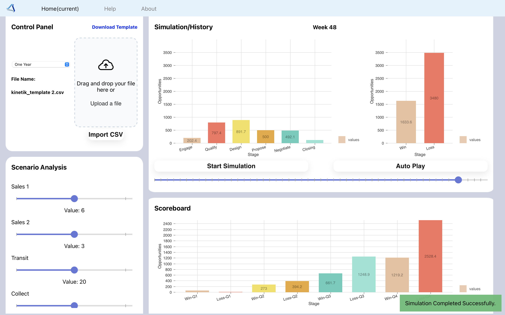

# Kinetik Simulation
Kinetik Simulation is a web application that utilizes monte-carlo forecasting model to support enterprise revenue growth by optimizing go-to-market strategies through software.

## Table of Contents
* [Getting Started](#getting_started)
* [Documentation Folder](https://github.com/TaoHuang0/Kinetik/tree/main/docs)
* [User Manual](https://github.com/TaoHuang0/Kinetik/blob/main/docs/UserManual.md)
* [Admin Manual](https://github.com/TaoHuang0/Kinetik/blob/main/docs/AdminManual.md)
* [FAQs](https://github.com/TaoHuang0/Kinetik/blob/main/docs/FAQ.md)

### Getting Started
* To view our application on the webswite, click into this link:
https://main.d2bkww882j30jj.amplifyapp.com/

* To run our applicaction locally in your envirnment, please follow this [admin guide](https://github.com/TaoHuang0/Kinetik/blob/main/docs/AdminManual.md)

* The `docs` folder contains information relating to all components of this repository.
# Kinetik Simulation
Kinetik Simulation is a web application that utilizes monte-carlo forecasting model to support enterprise revenue growth by optimizing go-to-market strategies through software.

## Table of Contents
* [Getting Started](#getting_started)
* [Documentation Folder](https://github.com/TaoHuang0/Kinetik/tree/main/docs)
* [User Manual](https://github.com/TaoHuang0/Kinetik/blob/main/docs/UserManual.md)
* [Admin Manual](https://github.com/TaoHuang0/Kinetik/blob/main/docs/AdminManual.md)
* [FAQs](https://github.com/TaoHuang0/Kinetik/blob/main/docs/FAQ.md)

### Getting Started
* To view our application on the webswite, click into this link:
https://main.d2bkww882j30jj.amplifyapp.com/

* To run our applicaction locally in your envirnment, please follow this [admin guide](https://github.com/TaoHuang0/Kinetik/blob/main/docs/AdminManual.md)

* The `docs` folder contains information relating to all components of this repository.
