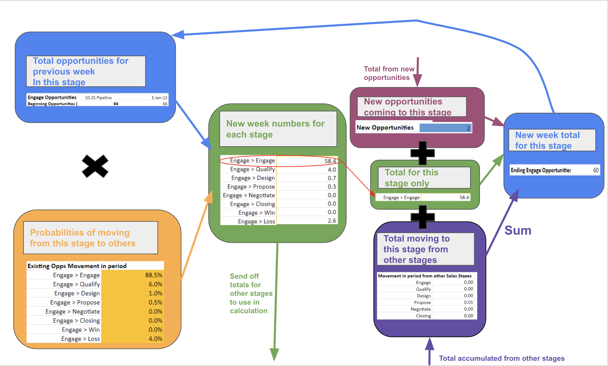

# Simulation Overview

The Kinetik simulation runs as a Lambda function in the amplify/backend/kinetikSimulationLamba/src folder in a file called index.py

This function is used to simulate the movement of opportunities through the sales pipeline by injecting new opportunities from multiple normal distributions each week and redistributing the opportunities in each stage using transition probabilities.

This is a serverless lambda function that is triggered by a POST request to the API endpoint /simulation.

The function is written in Python 3.8 and uses the numpy library to generate random numbers from normal distributions.

## Arguments: 
    
    event - The event that triggered the function, which is a JSON object that contains the body of the request with keys:

    1. weeks - The number of weeks to simulate
    2. ops - The number of opportunities in each stage at the start of the simulation
    3. stages - The stages of the sales pipeline
    4. sources - The sources of the opportunities
    5. means - The means of the normal distributions for each source
    6. stds - The standard deviations of the normal distributions for each source
    8. newOpsProbabilities - The probabilities of new opportunities coming in from each source
    9. opsProbabilities - The probabilities of opportunities moving from each stage to each other stage

    context - an object that contains information about the invocation, function, and execution environment

## Return Type: 

    A JSON object that contains the body of the response with keys:

    1. statusCode - The status code for the response
    2. headers - The headers for the response
    3. body - The body of the response: a JSON object that contains the number of opportunities in each stage for each week:
        a. Stage - The stage of the sales pipeline
        b. values - The number of opportunities in the stage
    4. isBase64Encoded - A boolean that indicates if the body is base64 encoded

Here is an overview of how the simulation runs and what is being calculated for a specific stage:

