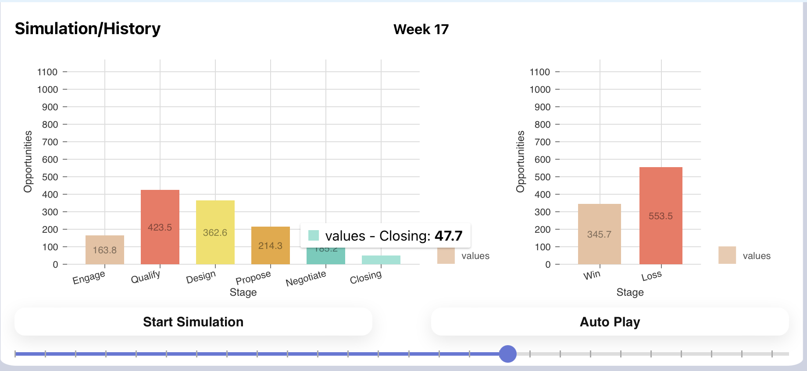
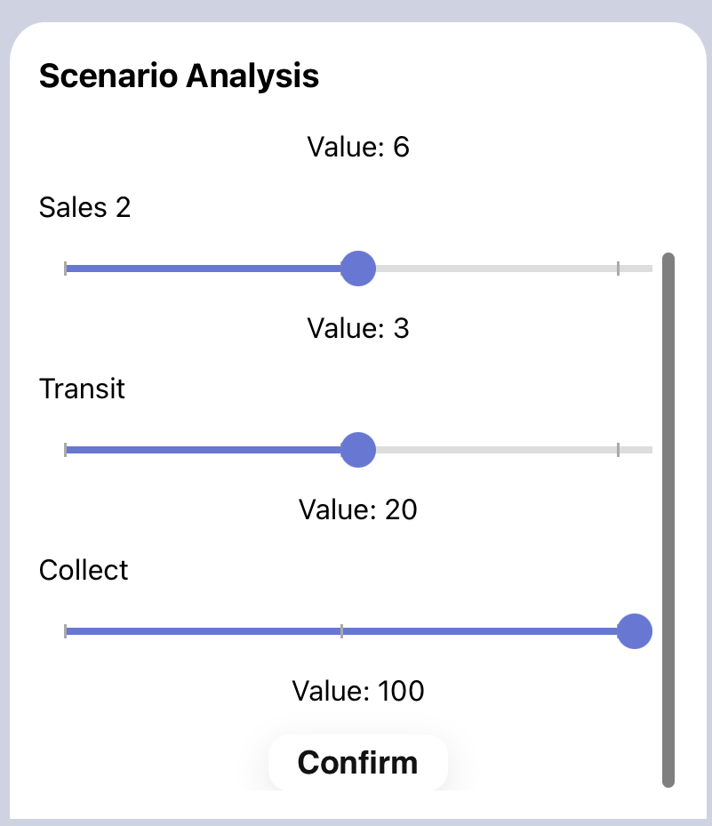

# User Manual

## Introduction
Many large enterprises struggle to grow their business because they lack insight into the constraining factors in their go-to market models. Go-to market models cross multiple functions including Sales, Marketing, Sales Operations, Business Partners, and Delivery. Kinetik’s solution provides scenario analysis to support go-to market optimization through a proprietary set of pipeline velocity metrics, sophisticated predictive analytics and simulation, and a user experience that combines animated simulation results and dynamic visualization of the model. The proprietary opportunity velocity metrics are calculated through the comparison of opportunity states in an automated comparison of historical weekly views extracted from leading CRM systems including Salesforce, Microsoft, and SugarCRM.

The model produces superior forecasts through cluster analysis of opportunities to identify opportunity attributes (e.g. identification channel, seller community, marketing tactic, prospect industry, etc) with similar opportunity progression profiles. These clusters, “traunches,” become the foundation of the forecasting engine and a unique go-to market profile is developed through an automated machine learning method that assesses week by week changes of a series of historical pipeline snapshots. The solution additionally supports executive level dashboards and simulation visualizations that allow scenario analysis to be executed in real-time without requiring a detailed understanding of the underlying data science and velocity statistics.

## Overview
We developed a web application that utilizes monte-carlo forecasting model to support enterprise revenue growth by optimizing go-to-market strategies through software. With our application, users can upload their data, create scenarios and visualize the impact of go-to-market model changes on the opportunity pipeline in the application.

## Purpose

Our project aims to solve several problems faced by large enterprises in optimizing their go-to-market strategies and improving revenue growth. These problems include:

1. Lack of insight into the constraining factors in their go-to-market models.
Inability to cross multiple functions including Sales, Marketing, Sales Operations, Business Partners, and Delivery.

2. Poor forecasting accuracy due to a lack of visibility into opportunity velocity metrics.

3. Difficulty in identifying opportunity attributes and developing a unique go-to-market profile.
4. Lack of real-time scenario analysis capabilities.

5. Complexity of underlying data science and velocity statistics that make it challenging for executives to understand and use the information effectively.

By developing a web application that utilizes monte-carlo forecasting model and combines animated simulation results and dynamic visualization of the model, this project aims to address these problems and provide enterprises with a comprehensive solution for optimizing their go-to-market strategies and improving revenue growth.

## Get Started
To get started, make sure you are connected to the internet and open the following link: https://main.d2bkww882j30jj.amplifyapp.com/. This will take you to the Kinetik Simulation Application View.

Upon opening the website, you will see a pop-up message welcoming you to Kinetik Simulation and prompting you to upload a data file to begin the simulation. Simply click the 'OK' button to exit the alert.

Since you have not uploaded the data file yet, the simulation has not been triggered, and all other modules are showing as empty.

To upload your data file, navigate to the right-hand side of the `Control Panel` and click the 'download template' link. This will download a CSV template file for you to fill in.

> **ATTENTION**: Please follow the guidance provided in the [GUIDEANCE](./UploadFileGuidance.md) file to complete your upload file. It is essential to follow the format in the guidance file thoroughly for the application to parse your file and run the simulation.

To upload your file, save it to your local device as a CSV file, and then click the upload area in the Control Panel to select and upload it to the application.

Once you have uploaded the file, select the duration for which you want to forecast by using the dropdown menu in the Control Panel. If you are not sure how long you want to forecast, simply select 'Half Year.'

After selecting the duration of the simulation, click the 'Import CSV' button. This will automatically save your file into your browser's local storage and trigger the simulation.

Please wait for a few seconds...

If your file is in the correct format and can be parsed by the application, you will see two pop-up messages indicating that your file was uploaded successfully and the simulation completed successfully.

> **Notice**: If your file is not in the correct format, you will see an error message pop up. In this case, please go back to your data file and use the guidance to modify your file. For more information and help, please refer to the [troubleshooting]() or [FAQ]()sessions, or contact the [kinetik simulation staff](https://www.kinetiksimulation.com).

You can now see the simulation running in the 'Simulation/History' and 'Scoreboard' modules.

In the `Simulation/History module`, you can see the values of each stage in each week, as well as the wins and losses generated by those stages. Use the slider to easily navigaye to the week you want to see. If the value is too small, just hover your mouse over the bar to see the exact value. Click the `auto play` button to automatically switch between weekly results and get a better sense off how the stages change and generate revenue week by week. *Notice:* The values show in thie module is cumulated.

At the buttom right, there is a `Scoreboard Module` for you to keep track of quarterly wins and loses. Each bar in this module is representing the wins and losses for the 13 weeks duration. *Notice:* The values show in thie module is NOT cumulated.

## Features
There are two features you can use to see the result from the simulation:

1. Using the `auto play` button in the Simulation/History Module. The auto play button is used to automatically play the simulation week by week without the user having to manually slide the slider to the right. The simulation will automatically stop after reaching the end of duration.

2. Using the `Slider` in the button of the Simulation/History Module. The slider is used to control the week of simulation result being displayed in the simulation module.

## Create Scenarios
On the bottom left, you can create scenarios with different sliders based on your input file. Once you visualize the simulation results, you may want to try out different scenarios by adjusting the sliders up or down to observe their impact. After adjusting the slider values, click the 'Confirm' button located at the bottom of the 'Scenario Module'.

> *Attention:* Please note that if there are too many new opportunity sliders, the 'Confirm' button may be hidden. In such cases, scroll down to the end of the 'Scenario Module' to find it.

You should see changes in the simulation results after adjusting the slider values and clicking the 'Confirm' button.

